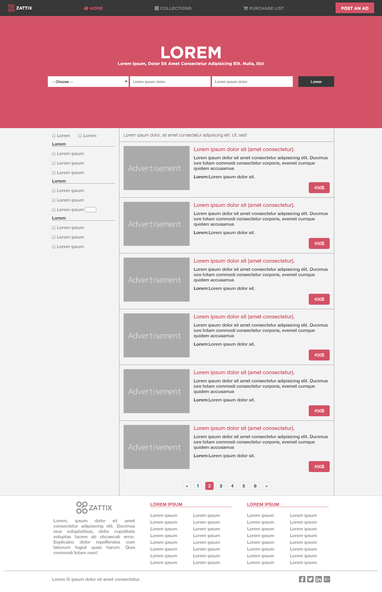

# Electroshop

> Online smart watches shop HTML template.

---

> This HTML template is based on the [design](https://www.behance.net/gallery/24796463/ZATTIX) by [Mohammed Awad](https://www.behance.net/M_Awad) from Behance

---

## About

Electroshop is an HTML template of an online shop for smart watches.
It is build using HTML5 and CSS3 with a grid system based on the grid css layout.

## Technical Aspects

- CSS grid was used for the main layout, using [griddle](https://github.com/aldemeery/griddle), which is
  a very lightweight grid system based on the `display: grid` css property.
- Flexbox was used at specific parts of the page, like the nav bar, the header body, and the button groups.
- No javascript was used.
- The design is fully responsive acorss different view port sizes.

## Live Preview

Click [here](https://raw.githack.com/aldemeery/electroshop/develop/index.html) for a live preview.

## Screenshots

## Authors

👤 **Osama Aldemeery**

- Github: [@aldemeery](https://github.com/aldemeery)
- Twitter: [@aldemeery](https://twitter.com/aldemeery)
- Linkedin: [osamaaldemeery](https://linkedin.com/in/osamaaldemeery)

## 🤝 Contributing

Contributions, issues and feature requests are welcome!

Feel free to check the [issues page](issues/).

## Show your support

Give a ⭐️ if you like this project!

## 📝 License

This project is [MIT](LICENSE) licensed.
